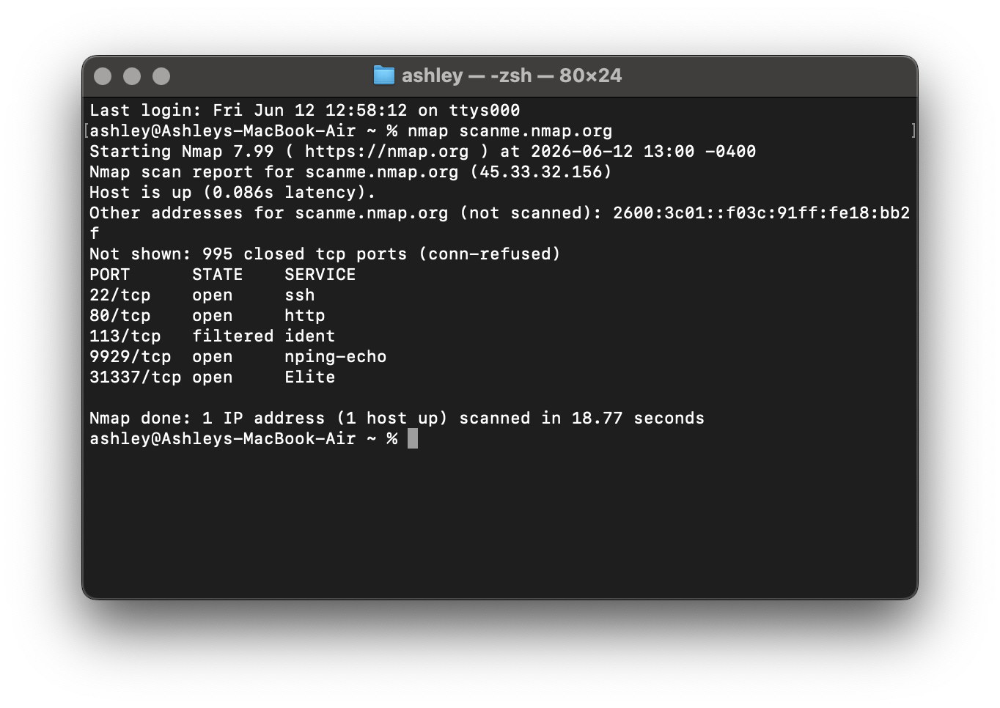
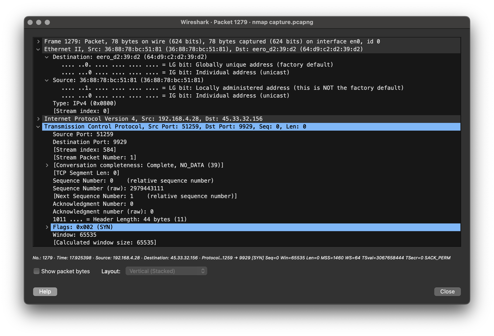
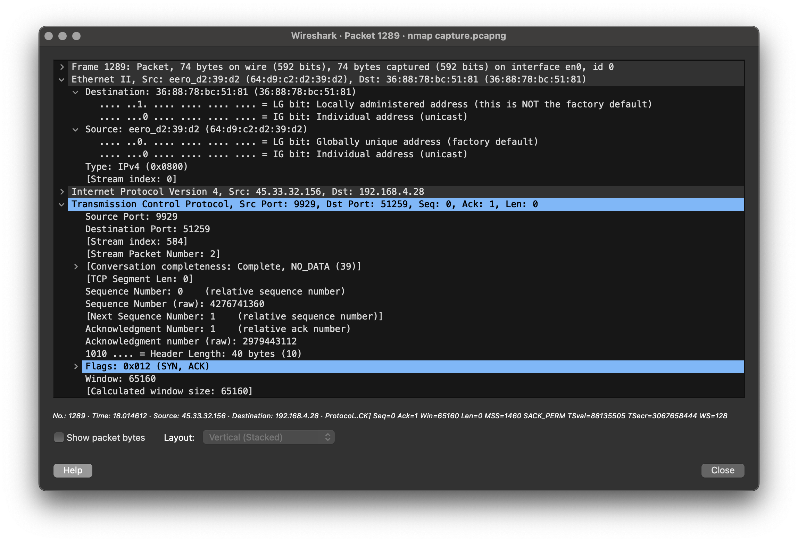
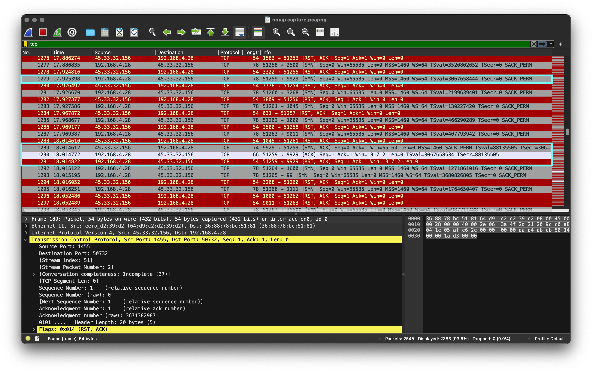
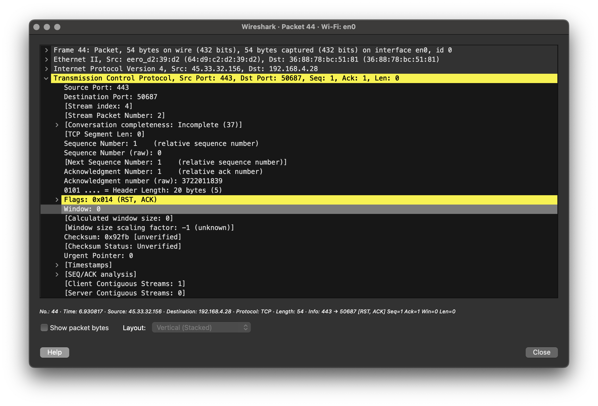

# Nmap Scan Detection and Analysis

**Objective:** Generate a port scan using Nmap and analyze the resulting traffic in Wireshark to identify open and closed ports, observe TCP handshake behavior, and understand how reconnaissance activity appears on a network.

## Nmap Scan Results

Target Host: scanme.nmap.org (45.33.32.156)

Open Ports Identified:  
22/tcp (ssh)  
80/tcp (http)  
9929/tcp (nping-echo)  
31337/tcp (Elite)  

Observation: Nmap was used to scan the target host and identify active services. The scan detected TCP ports 22, 80, 113, 9929, and 31337 as open. For this lab, I focused on verifying the results for port 9929, which Nmap identified as the nping-echo service. These findings were then validated through packet analysis in Wireshark.

---

## SYN Packet Analysis

Source IP: 192.168.4.28 (MacBook Air)

Destination IP: 45.33.32.156

Destination Port: 9929

Observation: A TCP SYN packet was sent from the source host to destination port 9929. This packet represents the first step of the TCP three-way handshake and was used by Nmap to determine whether a service was listening on the target port.

---

## SYN-ACK Response Analysis

Source IP: 45.33.32.156

Destination IP: 192.168.4.28

Source Port: 9929

Observation: The target host responded with a SYN-ACK packet, indicating that a service was actively listening on port 9929. This response confirmed that the port was open and available to accept connections.

---

## TCP Handshake Analysis

Source IP: 192.168.4.28

Destination IP: 45.33.32.156

Destination Port: 9929

Observation: A complete TCP three-way handshake was observed between the source and destination hosts. The connection was established through the exchange of SYN, SYN-ACK, and ACK packets, confirming that port 9929 was open. Immediately after the handshake, a RST-ACK packet was sent to terminate the connection.

---

## Closed Port Analysis

Source IP: 192.168.4.28
Destination IP: 45.33.32.156

Destination Port: 443

Observation: A TCP SYN packet was sent to destination port 443, and the target responded with a RST-ACK packet. This response indicated that the port was closed and that no service was listening on that port. By comparing this response to the SYN, SYN-ACK, and ACK sequence observed on open ports, it was possible to distinguish between available and unavailable services on the target system.
